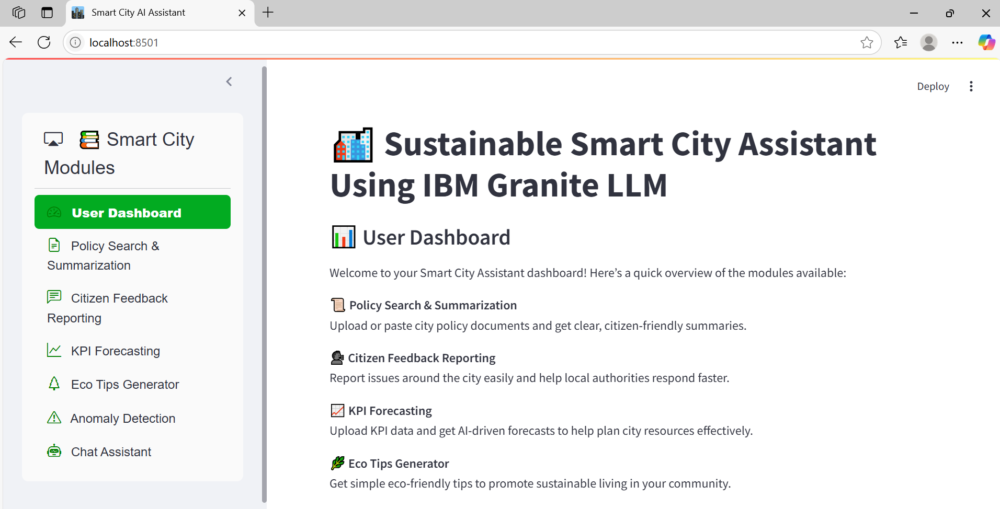

# 🌆 Sustainable Smart City Assistant Using IBM Granite LLM🤖


An AI-powered platform built with Streamlit and IBM Watsonx Granite LLM to promote urban sustainability, governance, and citizen engagement. This app integrates multiple smart city modules — from policy summarization to anomaly detection — providing actionable insights for municipal planners and citizens alike.

---

## 🚀 Features

### 🏠 User Dashboard  
An intuitive dashboard showcasing all modules with icons and brief descriptions to help users easily navigate and explore the app functionalities.

### 📜 Policy Search & Summarization  
Upload city policy PDFs or paste policy text. Get concise, citizen-friendly summaries generated by IBM Watsonx Granite LLM for easy understanding of complex policies.

### 📣 Citizen Feedback Reporting  
Submit reports about city issues in categories like water, electricity, sanitation, roads, etc. Feedback is logged and categorized for municipal action.

### 📈 KPI Forecasting  
Upload KPI CSV data (e.g., water usage or energy consumption). Receive AI-generated forecasts and trend insights to assist in urban resource planning.

### 🌿 Eco Tips Generator  
Enter an environmental keyword to generate 5 practical eco-friendly tips aimed at promoting sustainable living among citizens.

### ⚠️ Anomaly Detection  
Upload KPI data to detect unusual patterns or anomalies, helping identify potential issues in city resource consumption or management.

### 💬 Chat Assistant  
An interactive AI chat module powered by IBM Granite LLM, answering citizen queries about sustainability, governance, and city services.

---

## 🛠️ Technology Stack

- **Frontend:** Streamlit for building an interactive and user-friendly UI  
- **Backend AI:** IBM Watsonx Granite LLM for natural language processing and generation  
- **PDF Handling:** PyMuPDF (fitz) for extracting text from policy documents  
- **Data Handling:** Pandas for CSV data processing  
- **UI Components:** `streamlit_option_menu` for sidebar navigation  
- **Deployment:** Can be deployed on Streamlit Cloud, Heroku, or any Python-compatible cloud environment

---

## ⚙️Getting Started

### Prerequisites

- Python 3.8+  
- IBM Watsonx API Key and Project ID  
- Install dependencies:

---

## 📦 Installation & Setup

1. Clone the repo:
   ```bash
   git clone https://github.com/PakanatiVigneswari/sustainable-smart-city.git
   cd sustainable-smart-city
   ```
2. Update the IBM Watsonx credentials in app.py:
   ```bash
    api_key = "YOUR_IBM_WATSONX_API_KEY"
    project_id = "YOUR_PROJECT_ID"
    base_url = "https://YOUR_REGION.ml.cloud.ibm.com"
   ```
3. Install dependencies:
   ```bash
     pip install -r requirements.txt
   ```
4. Run the App Locally
   ```bash
    streamlit run app.py
   ```
---
## 📂 Project Structure

```bash

├── app.py               # Main Streamlit app
├── requirements.txt     # Python dependencies
├── img.png  
└── README.md            # Project documentation
```
---
## Project Overview: 



---

## 🤝 Contributions
Contributions are welcome! Please open issues or pull requests.

